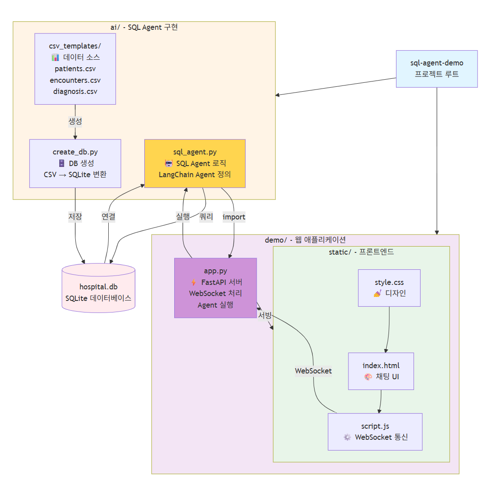
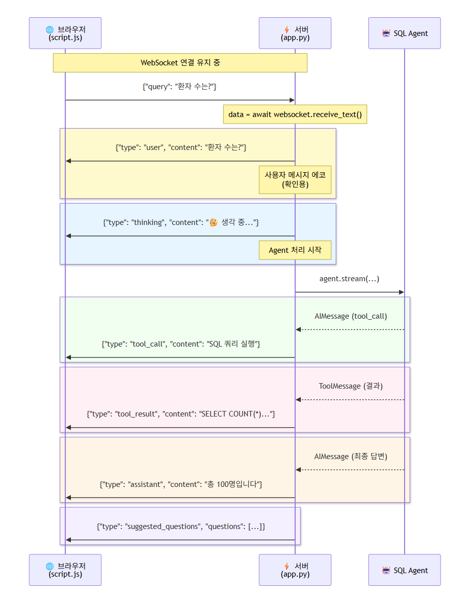

# AI Agent 개발 실무 과정: Text2SQL과 클로드 코드를 활용한 챗봇제작까지

## 커리큘럼

| 시간 | 내용 | 유형 | 실습 파일 | 세부 구성 |
|------|------|------|-----------|-----------|
| 16:00–16:20 | AI Agent 개념 이해하기 | 이론 | - | - AI Agent의 정의<br>- 도구(Tools)의 역할<br>- ReAct 패턴 소개<br>- LangChain Agent 구조 |
| 16:20–16:50 | [실습] LangChain Agent 기초 | 실습 | `langchain_create_agent.ipynb` | - `create_agent` 함수 이해<br>- 커스텀 도구 정의하기<br>- 도구 파라미터 설정<br>- Agent 실행 및 디버깅 |
| 16:50–17:30 | [실습] SQL Agent 데모 만들기 | 실습 | `sql_agent.py` | - hospital.db 데이터 탐색<br>- SQL Agent 코드 분석 |
| 17:30–18:00 | [실습] 클로드 코드와 함께 완성하는 챗봇 데모 | 자율 실습 | `demo/` | - 웹 데모 실행 및 테스트<br>- Claude Code와 함께 커스터마이징<br>  * CSV 데이터 수정하기<br>  * 질문 시나리오 추가하기<br>  * UI 디자인 변경하기 |


---

## 빠른 시작

### 사전 준비사항
- Python 3.11 이상
- OpenAI API 키
- Git, VS Code

### 1. 프로젝트 클론 및 설치

```bash
# 저장소 클론
git clone <repository-url>
cd sql-agent-demo

# 패키지 설치
uv sync

# 가상환경 활성화
.venv\Scripts\activate  # Windows
source .venv/bin/activate  # Mac/Linux
```

```bash
# 가상환경이 활성화된 상태에서
# Jupyter 커널 등록
python -m ipykernel install --user --name=sql-agent --display-name="Python (sql-agent)"
```
```bash
jupyter kernelspec list
```

### 2. API 키 설정

**ai 폴더에 .env 파일 생성:**

```bash
copy .env.example .env
# .env 파일 편집하여 API 키 입력
```


### 3. 데이터베이스 확인

`hospital.db`가 없으면 첫 실행 시 `csv_templates`에서 자동으로 생성됩니다.

수동으로 생성하려면:

```bash
cd ai
python create_db.py
```

### 4. 실습 시작

#### Step 1: Jupyter Notebook으로 시작

```bash
# Jupyter Lab 실행
jupyter lab

# 또는 Jupyter Notebook
jupyter notebook

# langchain_create_agent.ipynb 열기
```

#### Step 2: SQL Agent 직접 실행

```bash
cd ai
python sql_agent.py
```

#### Step 3: 데이터 커스터마이징

```bash
# 1. CSV 파일 편집
cd csv_templates
# Excel로 patients.csv, encounters.csv, diagnosis.csv 편집

# 2. 데이터베이스 재생성
cd ..
python create_db.py
```

#### Step 4: 웹 데모 실행 및 커스터마이징

```bash
cd ../demo
python app.py
# 브라우저에서 http://localhost:8000 접속
```

---

## 프로젝트 구조

```
sql-agent-demo/
├── pyproject.toml          # 통합 패키지 관리
├── .venv/                  # 가상환경
│
├── ai/                     # SQL Agent 구현
│   ├── sql_agent.py        # Agent 클래스
│   ├── load_csv_to_db.py   # CSV → DB 변환
│   ├── examples.py         # 사용 예제
│   ├── csv_templates/      # 엑셀 편집 가능 CSV
│   │   ├── patients.csv
│   │   ├── encounters.csv
│   │   └── diagnosis.csv
│   └── README.md           # 상세 가이드
│
└── demo/                   # 웹 UI
    ├── app.py              # FastAPI 서버
    ├── static/
    │   ├── index.html      # 채팅 UI
    │   ├── style.css       # 디자인
    │   └── script.js       # WebSocket 통신
    └── README.md           # Demo 가이드
```

### 프로젝트 구성 다이어그램




### WebSocket 기반 요청 및 결과 전달



📍 본 레포지토리는 강릉아산병원 AI Agent 과정의 실습 코드입니다.
